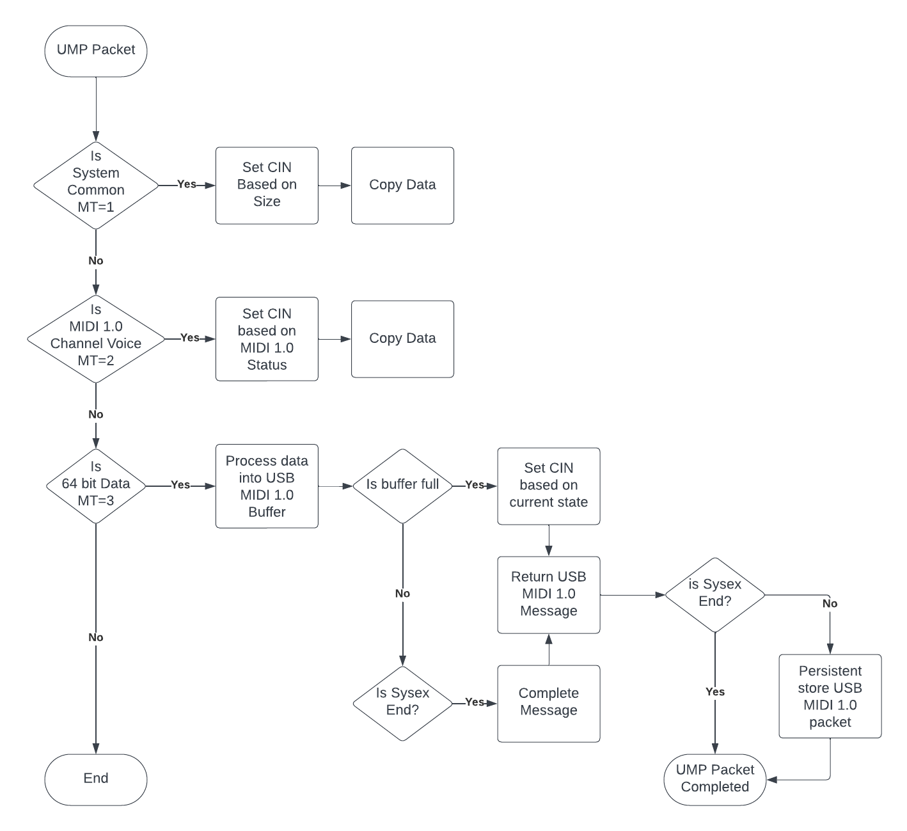
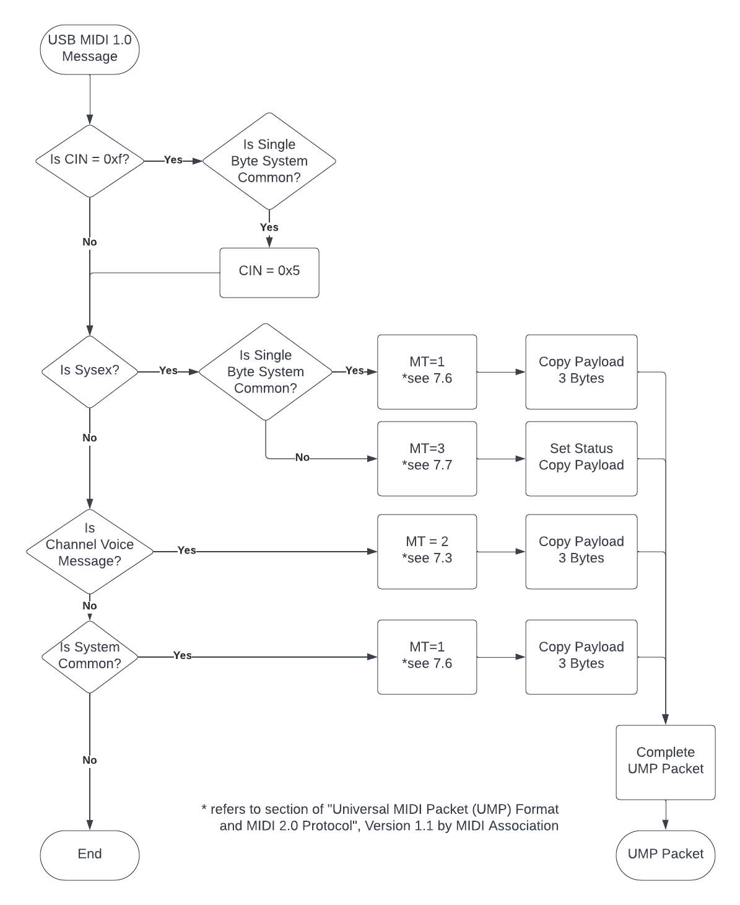

# AmeNoteTM tusb_ump Device Driver for tinyUSB

AmeNote Universal MIDI Packet (UMP) USB MIDI 2.0 / USB MIDI 1.0 Class Driver for tinyUSB Device

## Welcome

As part of the midi2.dev community and with the intention of contributing back to tinyUSB, AmeNote is providing a class driver for USB MIDI (either 1.0 or 2.0) for tinyUSB USDB Device integrations. With the correct descriptors and configuration, the driver will enable embedded devices using the
[tinyUSB embedded library](https://www.tinyusb.org).

The driver is compatible with hosts selecting either USB MIDI 2.0 or USB MIDI 1.0 standard. If
USB MIDI 1.0, the driver will translate between USB MIDI 1.0 and UMP packets. All embedded applications will interface using UMP packet data structure as a series of 32-bit words.

TODO: Example code and integration guide will be provided

## UMP to USB MIDI 1.0

When the host computer initializes the device as a USB MIDI 1.0 device, the UMP packets from embedded applications need to be converted to USB MIDI 1.0 packets to send to host computer. This is achieved by the following translation logic:

## USB MIDI 1.0 to UMP

Similarly, when initialized as a USB MIDI 1.0 device, the data from the host computer needs to be converted to UMP packets for presentation to the embedded applications. This is achieved b y the following translation logic:

## MIDI Association ([www.midi.org](http://www.midi.org))
These drivers were developed and tested in conjunction of the ProtoZOA TM MIDI 2.0 Prototyping tool which was developed to support the MIDI Association towards their mission for corporate members to:
- Develop and enhance MIDI to respond to new market needs
- Create new MIDI 2.0 standards with broad industry participation
- Ensure the interoperability of MIDI products
- Protect the term MIDI and MIDI logo markets
- Promote the use of MIDI technology and products.

The tusb_ump for tinyUSB driver was developed in compliance to the standards provided by the MIDI Association. In addition, many member companies have utilized these drivers along with the ProtoZOA for their own prototyping efforts. These drivers have been through extensive operational testing.

## MIT License

Copyright (c) 2023 MIDI2.dev

Permission is hereby granted, free of charge, to any person obtaining a copy
of this software and associated documentation files (the "Software"), to deal
in the Software without restriction, including without limitation the rights
to use, copy, modify, merge, publish, distribute, sublicense, and/or sell
copies of the Software, and to permit persons to whom the Software is
furnished to do so, subject to the following conditions:

The above copyright notice and this permission notice shall be included in all
copies or substantial portions of the Software.

THE SOFTWARE IS PROVIDED "AS IS", WITHOUT WARRANTY OF ANY KIND, EXPRESS OR
IMPLIED, INCLUDING BUT NOT LIMITED TO THE WARRANTIES OF MERCHANTABILITY,
FITNESS FOR A PARTICULAR PURPOSE AND NONINFRINGEMENT. IN NO EVENT SHALL THE
AUTHORS OR COPYRIGHT HOLDERS BE LIABLE FOR ANY CLAIM, DAMAGES OR OTHER
LIABILITY, WHETHER IN AN ACTION OF CONTRACT, TORT OR OTHERWISE, ARISING FROM,
OUT OF OR IN CONNECTION WITH THE SOFTWARE OR THE USE OR OTHER DEALINGS IN THE
SOFTWARE.

## Contributors

We wish to thank and acknowledge all contributors to this project. In particular we would like to callout to the following midi2.dev individuals who contributed early and extensively to the development of the tusb_ump driver.

| Name  | Organization  | Email  | Contribution  |
|:----------|:----------|:----------|:----------|
| Michael Loh    | AmeNote    | [mloh@AmeNote.com ](mailto:mloh@AmeNote.com)   | tinyUSB MIDI 2.0 Device Driver initial integration and other low level components.    |
| Mike Kent    | AmeNote    | [mikekent@AmeNote.com](mailto:mikekent@AmeNote.com)    | Concept, Architecture, MIDI 2.0 Technical Support.    |
| Andrew Mee    | AmeNote (consultant)    | [primary.edw@gmail.com ](mailto:primary.edw@gmail.com)   | Various firmware integration, MIDI 2.0 and UMP libraries, Capability Inquiry, MIDI 2.0 Technical support, testing.    |
| Franz Detro | Native Instruments | [franz.detro@native-instruments.de](mailto:franz.detro@native-instruments.de) | Inputs into usb midi 2.0 class driver to clean up descriptors and control endpoint sync. |

## Contributing

We invite for collaborative and constructive contributions. You can contribute by submitting detailed information in Issues for requests for features and bugs. We also welcome contributions of code.

TODO: Contribution agreement.

##### AmeNote, AmeNote Logo and ProtoZOA are trademarks of AmeNote Inc.
##### Copyright (c) MIDI2.dev, 2023.
