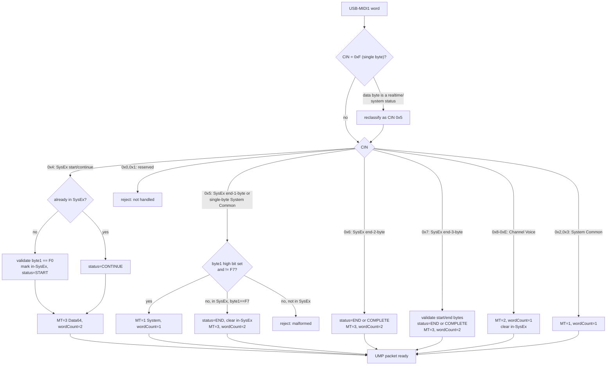
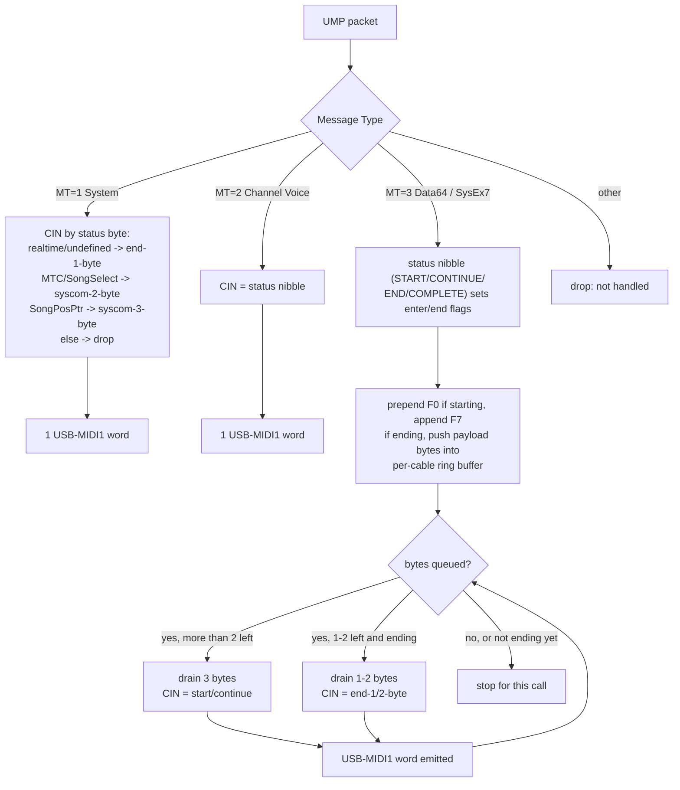

# AmeNoteTM tusb_ump Device Driver for tinyUSB

A TinyUSB device class driver implementing the USB Device Class Definition
for MIDI Devices v2.0: a single MIDIStreaming interface exposing both
Alternate Setting 0 (legacy USB-MIDI 1.0 byte stream) and Alternate Setting 1
(native Universal MIDI Packet / USB MIDI 2.0), converting transparently
between them so application code only ever handles UMP words.

This document assumes familiarity with TinyUSB's device stack (class driver
registration, endpoint/descriptor conventions, `tud_task()`) and with USB in
general; it covers what's specific to this driver, not USB or TinyUSB basics.

## Why one driver handles both alt settings

A USB MIDI 2.0 host negotiates Alt Setting 1 and talks UMP directly. A host
that only understands USB MIDI 1.0 stays on Alt Setting 0, sending/receiving
the legacy 4-byte USB-MIDI1 packet format. Both alt settings share the same
endpoint pair, so the driver -- not the application -- is what needs to know
which wire format is active on a given call; `ump_interface_selected` tracks
that per interface instance and both directions dispatch on it.

Application code always works in UMP words regardless of which alt setting
the host picked: `tud_ump_read*()` always returns UMP words (converting from
USB-MIDI1 if Alt 0 is active), and `tud_ump_write*()` always accepts UMP
words (converting to USB-MIDI1 if Alt 0 is active).

## API surface

| Function | Direction | Endianness |
|---|---|---|
| `tud_ump_read_ntoh` | read | host-native arithmetic value (MT in bits 31:28) -- recommended |
| `tud_ump_read` | read | raw byte-buffer reinterpretation, host-endian dependent -- legacy |
| `tud_ump_write_hton` | write | host-native arithmetic value -- recommended |
| `tud_ump_write` | write | raw byte-buffer reinterpretation, host-endian dependent -- legacy |

Use the `_ntoh`/`_hton` variants in new code: each `uint32_t` word you pass
or receive is the arithmetic value matching the UMP wire word (message type
in bits 31:28), safe to build/consume with ordinary bit-shifts and masks
regardless of host endianness. The plain `tud_ump_read`/`tud_ump_write`
reinterpret the raw byte buffer with no conversion -- kept only for
applications already built against that behavior.

`tud_ump_n_mounted`, `tud_ump_n_available`, `tud_ump_n_writeable`, and
`tud_alt_setting` report interface/FIFO state; `tud_ump_rx_cb`,
`tud_ump_set_itf_cb`, and `tud_ump_get_req_itf_cb` are optional weak
callbacks an application can override. See `ump_device.h` for exact
signatures.

A read for the legacy alt setting can convert a single incoming USB-MIDI1
word into up to 2 UMP words (a SysEx7 completion produces a 64-bit UMP data
message), so it's bounded against remaining output space, not input words
consumed -- passing a 1-word buffer is enough for any message, no special
sizing is required.

## Conversion logic

### USB-MIDI1 to UMP (read path, Alt Setting 0)

```mermaid
flowchart TD
    A[USB-MIDI1 word] --> B{"CIN = 0xF (single byte)?"}
    B -->|"data byte is a realtime/<br/>system status"| C["reclassify as CIN 0x5"]
    B -->|no| D{CIN}
    C --> D
    D -->|"0x4: SysEx start/continue"| E{already in SysEx?}
    E -->|no| F["validate byte1 == F0<br/>mark in-SysEx, status=START"]
    E -->|yes| G["status=CONTINUE"]
    F --> H["MT=3 Data64, wordCount=2"]
    G --> H
    D -->|"0x5: SysEx end-1-byte or<br/>single-byte System Common"| I{"byte1 high bit set<br/>and != F7?"}
    I -->|yes| J["MT=1 System, wordCount=1"]
    I -->|"no, in SysEx, byte1==F7"| K["status=END, clear in-SysEx<br/>MT=3, wordCount=2"]
    I -->|"no, not in SysEx"| L[reject: malformed]
    D -->|"0x6: SysEx end-2-byte"| M["status=END or COMPLETE<br/>MT=3, wordCount=2"]
    D -->|"0x7: SysEx end-3-byte"| N["validate start/end bytes<br/>status=END or COMPLETE<br/>MT=3, wordCount=2"]
    D -->|"0x8-0xE: Channel Voice"| O["MT=2, wordCount=1<br/>clear in-SysEx"]
    D -->|"0x2,0x3: System Common"| P["MT=1, wordCount=1"]
    D -->|"0x0,0x1: reserved"| Q[reject: not handled]
    H --> R[UMP packet ready]
    J --> R
    K --> R
    M --> R
    N --> R
    O --> R
    P --> R
```

### UMP to USB-MIDI1 (write path, Alt Setting 0)

A UMP SysEx7 packet carries up to 6 payload bytes, but a USB-MIDI1 SysEx
report is 4 bytes carrying at most 3; a per-cable ring buffer decouples the
two, queuing whatever a UMP packet delivers and draining it 1-3 bytes at a
time, so a single UMP packet can emit several USB-MIDI1 words in one call.

```mermaid
flowchart TD
    A[UMP packet] --> B{Message Type}
    B -->|"MT=1 System"| C["CIN by status byte:<br/>realtime/undefined -> end-1-byte<br/>MTC/SongSelect -> syscom-2-byte<br/>SongPosPtr -> syscom-3-byte<br/>else -> drop"]
    C --> D[1 USB-MIDI1 word]
    B -->|"MT=2 Channel Voice"| E["CIN = status nibble"]
    E --> F[1 USB-MIDI1 word]
    B -->|"MT=3 Data64 / SysEx7"| G["status nibble (START/CONTINUE/<br/>END/COMPLETE) sets enter/end flags"]
    G --> H["prepend F0 if starting, append F7<br/>if ending, push payload bytes into<br/>per-cable ring buffer"]
    H --> I{bytes queued?}
    I -->|"yes, more than 2 left"| J["drain 3 bytes<br/>CIN = start/continue"]
    I -->|"yes, 1-2 left and ending"| K["drain 1-2 bytes<br/>CIN = end-1/2-byte"]
    I -->|"no, or not ending yet"| L[stop for this call]
    J --> M[USB-MIDI1 word emitted]
    K --> M
    M --> I
    B -->|other| N[drop: not handled]
```

## Examples

- [`examples/tusb_ump_lb`](examples/tusb_ump_lb) -- minimal loopback reference
  for the descriptor layout and read/write API on a Raspberry Pi Pico
  (RP2040); the best starting point for a new integration.
- [`examples/T-Display-S3-ESP32-S3-MIDI2-PingPong`](examples/T-Display-S3-ESP32-S3-MIDI2-PingPong)
  and [`examples/T-PicoC3-MIDI2-PingPong`](examples/T-PicoC3-MIDI2-PingPong) --
  community-contributed board-specific examples.

## Testing

[`test/host`](test/host) is a hardware-free regression suite for the
legacy-alt-setting conversion paths (buffer-space bounding, byte continuity
across split reads). Run with `make check`; no cross toolchain needed.

## MIDI Association ([www.midi.org](http://www.midi.org))
These drivers were developed and tested in conjunction of the ProtoZOA TM MIDI 2.0 Prototyping tool which was developed to support the MIDI Association towards their mission for corporate members to:
- Develop and enhance MIDI to respond to new market needs
- Create new MIDI 2.0 standards with broad industry participation
- Ensure the interoperability of MIDI products
- Protect the term MIDI and MIDI logo markets
- Promote the use of MIDI technology and products.

The tusb_ump for tinyUSB driver was developed in compliance to the standards provided by the MIDI Association. In addition, many member companies have utilized these drivers along with the ProtoZOA for their own prototyping efforts. These drivers have been through extensive operational testing.

## MIT License

Copyright (c) 2023-2026 MIDI2.dev

Permission is hereby granted, free of charge, to any person obtaining a copy
of this software and associated documentation files (the "Software"), to deal
in the Software without restriction, including without limitation the rights
to use, copy, modify, merge, publish, distribute, sublicense, and/or sell
copies of the Software, and to permit persons to whom the Software is
furnished to do so, subject to the following conditions:

The above copyright notice and this permission notice shall be included in all
copies or substantial portions of the Software.

THE SOFTWARE IS PROVIDED "AS IS", WITHOUT WARRANTY OF ANY KIND, EXPRESS OR
IMPLIED, INCLUDING BUT NOT LIMITED TO THE WARRANTIES OF MERCHANTABILITY,
FITNESS FOR A PARTICULAR PURPOSE AND NONINFRINGEMENT. IN NO EVENT SHALL THE
AUTHORS OR COPYRIGHT HOLDERS BE LIABLE FOR ANY CLAIM, DAMAGES OR OTHER
LIABILITY, WHETHER IN AN ACTION OF CONTRACT, TORT OR OTHERWISE, ARISING FROM,
OUT OF OR IN CONNECTION WITH THE SOFTWARE OR THE USE OR OTHER DEALINGS IN THE
SOFTWARE.

## Contributors

We wish to thank and acknowledge all contributors to this project. In particular we would like to callout to the following midi2.dev individuals who contributed early and extensively to the development of the tusb_ump driver.

| Name  | Organization  | Email  | Contribution  |
|:----------|:----------|:----------|:----------|
| Michael Loh    | AmeNote    | [mloh@AmeNote.com ](mailto:mloh@AmeNote.com)   | tinyUSB MIDI 2.0 Device Driver initial integration and other low level components.    |
| Mike Kent    | AmeNote    | [mikekent@AmeNote.com](mailto:mikekent@AmeNote.com)    | Concept, Architecture, MIDI 2.0 Technical Support.    |
| Andrew Mee    | AmeNote (consultant)    | [primary.edw@gmail.com ](mailto:primary.edw@gmail.com)   | Various firmware integration, MIDI 2.0 and UMP libraries, Capability Inquiry, MIDI 2.0 Technical support, testing.    |
| Franz Detro | Native Instruments | [franz.detro@native-instruments.de](mailto:franz.detro@native-instruments.de) | Inputs into usb midi 2.0 class driver to clean up descriptors and control endpoint sync. |

## Contributing

We invite collaborative and constructive contributions. Submit detailed information in Issues for feature requests and bugs, and pull requests for code contributions.

##### AmeNote, AmeNote Logo and ProtoZOA are trademarks of AmeNote Inc.
##### Copyright (c) MIDI2.dev, 2023-2026.
